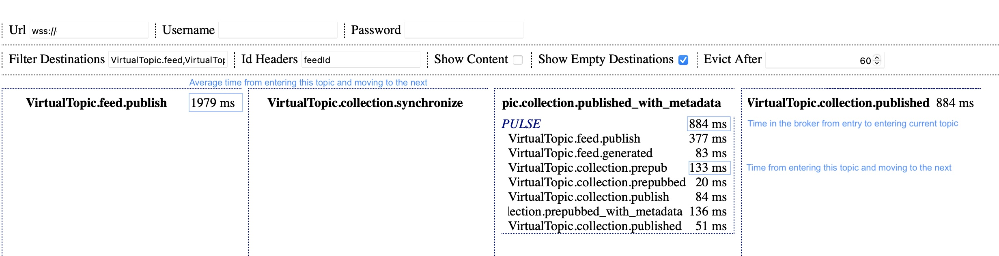

# VisuAMQ
Visual path and timing tracking of messages through ActiveMQ 

## Background
[ActiveMQ](https://activemq.apache.org) is a wonderful message broker that, especially in concert with [Camel](https://camel.apache.org), makes creating data processing pipelines something of a dream come true. ActiveMQ is performant, scalable, easy to configure and enhance. VisuAMQ is a quick and dirty visualization tool for ActiveMQ that was thrown together to track breadcrumbs through the ActiveMQ destinations and map out the routes that messages take with the hopes to quickly pinpoint bottlenecks and routing issues. 

## Broker configuration
Make sure your broker has [WebSockets](https://activemq.apache.org/websockets) enabled.

## Running
VisuAMQ is a browser-only application and does not require any backend services.  
You can fork this repo and point your browser to it.  
Or, if you do not want to install it, just go [here](https://maxfortun.github.io/visuamq/) and put in your broker information.  
Watch as messages traverse the topics of your broker.  

## Settings
VisuAMQ uses two methods to maintain settings.  
Defaults are stored in [js/settings.json](js/settings.json).  
Changes made via UI are stored in [localStorage](https://developer.mozilla.org/en-US/docs/Web/API/Window/localStorage).  

| Setting | Default | Description 
|---|---|---
| amqUrl | wss://activemq-hostname:61615 | Broker websocket url 
| amqUsername | username | Broker username
| amqPassword | password | Broker password
| advisoryDestination | /topic/ActiveMQ.Advisory.Topic | Advisory destination to dynamically source destinations in use
| breadcrumbId | breadcrumbId | Message property that uniquely identifies the message throughout it's lifetime within the pipeline
| destinationPrefix | /topic/ | This tool is tested only with topics, but feel free to take it for a spin with queues if that's your architecture
| excludeDestinations | ^ActiveMQ\. | Comma separated list of RegExp strings. Skips ActiveMQ internals. If you have diagnostics destinations, you may want to add them here
| idHeaders | breadcrumbId | Comma separated list of message property names that may be used to unqieuly identify the message content  
| evictAfter | 60 | In seconds. Once at the last hope, the message will stay there until eviction expires
| showEmptyDestinations | false | Messages travel through their destinations very quickly and most branch destinations are usually empty and just pollute the screen space
| showContent | false | Not yet implemented. Useful if you want to see only the timing for destinations and do not care for the message routes
| filterDestinations | `empty` | Inclusion filter. Comma separated list of destination prefixes. Shows a subset matching the specified filter

